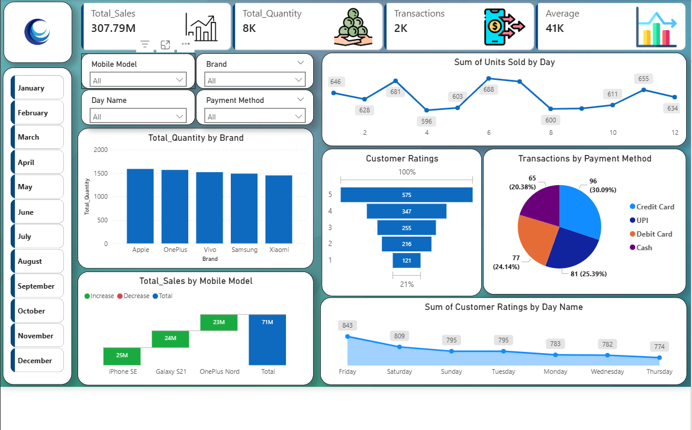
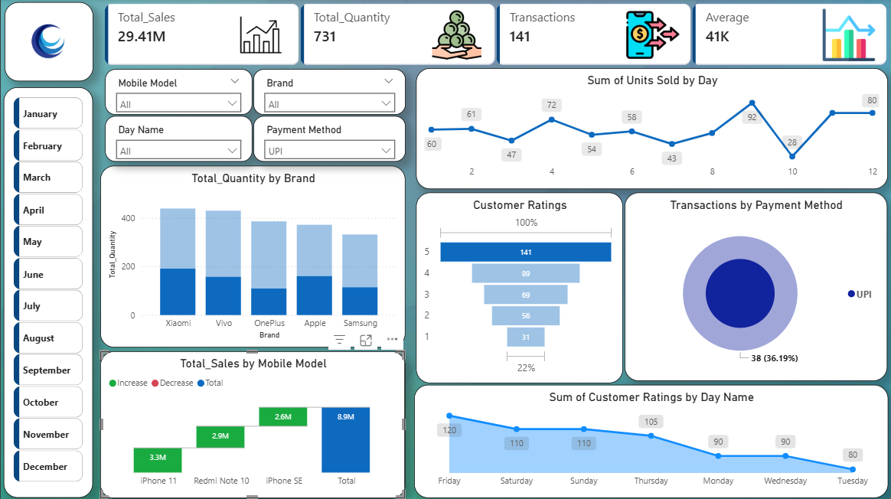
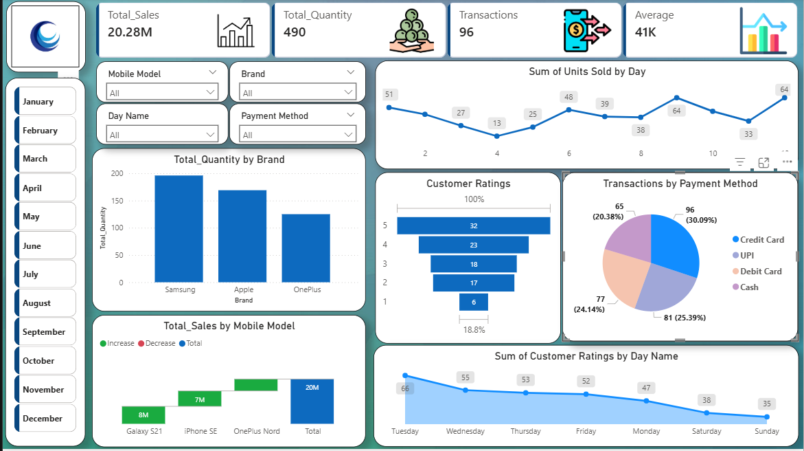
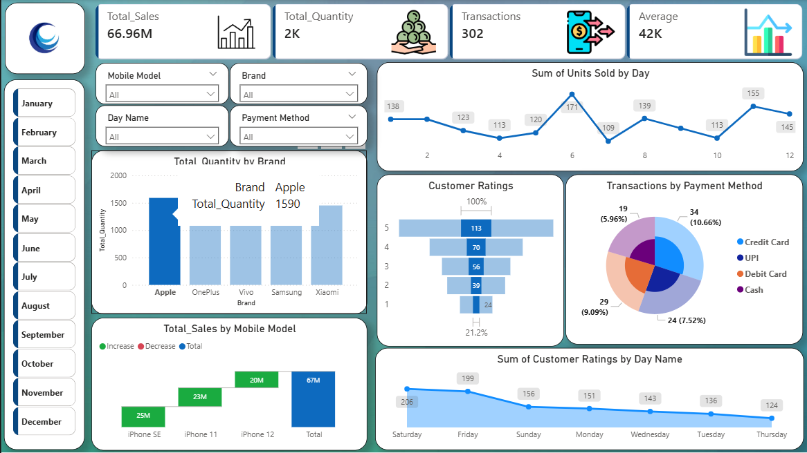

# 📊 Mobile Sales Analysis Dashboard – Power BI

## 📌 Project Overview
This Power BI dashboard provides a complete analysis of mobile sales performance across different months, brands, payment methods, and customer ratings.

The dashboard is fully interactive with slicers for:
- 📅 Month
- 📱 Mobile Model
- 🏷 Brand
- 💳 Payment Method
- 📆 Day Name

It enables dynamic filtering and real-time KPI updates.

---

## 🎯 Business Objective

The goal of this dashboard is to:

- Analyze monthly sales trends
- Identify top-performing brands
- Track payment method usage
- Understand customer satisfaction patterns
- Compare mobile model performance

---

## 📈 Key KPIs

- 💰 Total Sales
- 📦 Total Quantity Sold
- 🧾 Total Transactions
- 📊 Average Sales per Transaction

KPIs dynamically change based on filters.

---

# 📊 Dashboard Views

## 🔹 1️⃣ Overall Sales Dashboard


Provides a complete summary of:
- Total Sales (307.79M)
- Brand-wise quantity
- Payment distribution
- Customer ratings trend
- Model-wise contribution

---

## 🔹 2️⃣ January Filter View


Shows filtered analysis for January:
- Sales: 29.41M
- Quantity: 731
- Transactions: 141
- UPI-specific payment insight

---

## 🔹 3️⃣ March Filter View


March performance breakdown:
- Sales: 20.28M
- Quantity: 490
- Transactions: 96
- Brand comparison view

---

## 🔹 4️⃣ Brand Focus Analysis


Detailed brand-level breakdown:
- Apple total quantity: 1590
- Model-wise revenue contribution
- Customer rating distribution
- Payment method percentage split

---

# 📊 Visualizations Used

- KPI Cards
- Line Chart (Units Sold by Day)
- Bar Chart (Quantity by Brand)
- Waterfall Chart (Sales by Model)
- Pie/Donut Chart (Payment Method Distribution)
- Funnel Chart (Customer Ratings)
- Area Chart (Ratings by Day)

---

# 🛠 Tools & Technologies

- Power BI Desktop
- DAX Measures
- Data Modeling
- Slicers & Filters
- Data Transformation

---

# 📊 Sample DAX Measures

```DAX
Total Sales = SUM(Sales[Sales_Amount])

Total Quantity = SUM(Sales[Quantity])

Average Sales = DIVIDE([Total Sales], [Transactions])
